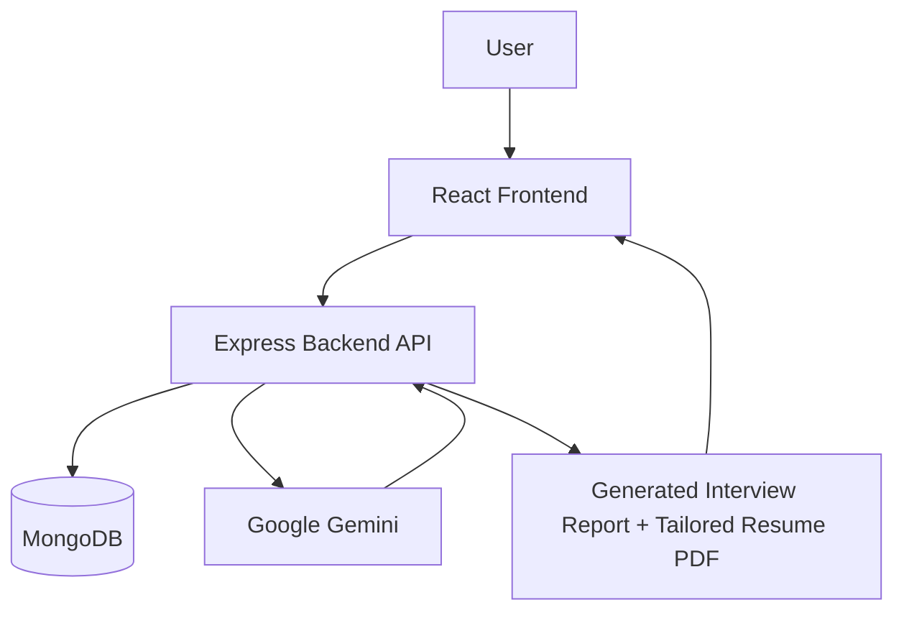
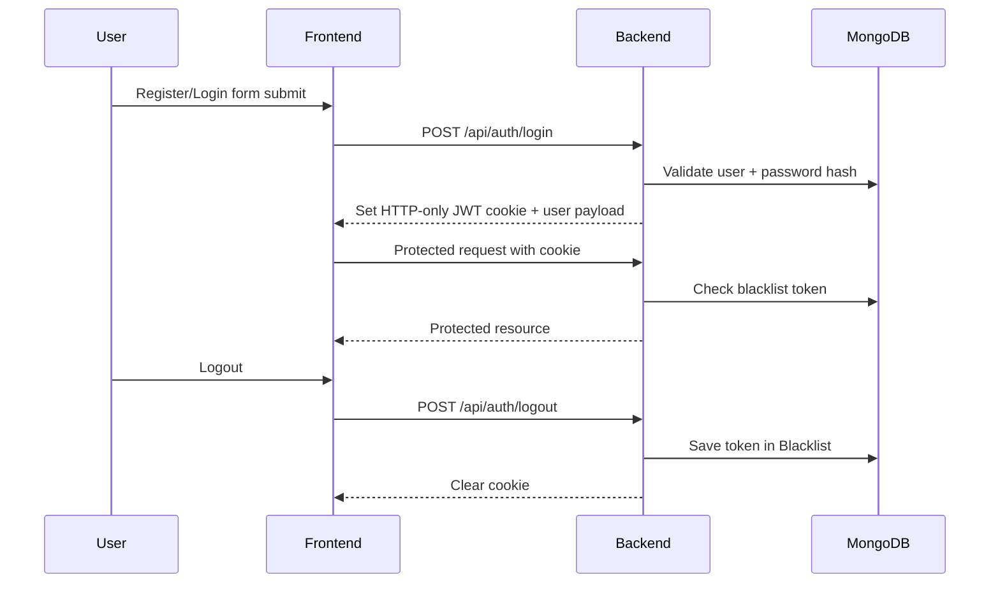
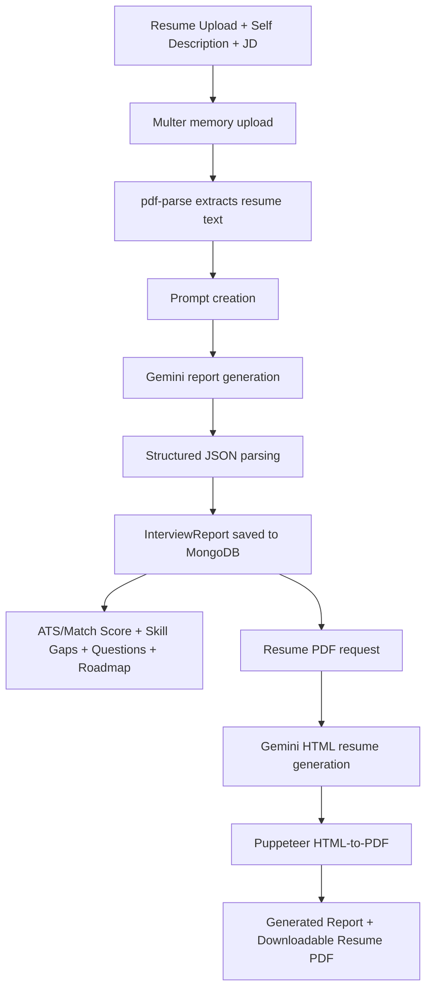

# CareerLens

## Title

**CareerLens — AI Interview Intelligence for job-focused resume strategy and interview preparation.**

CareerLens is a full-stack web application that helps candidates convert a target job description and their profile (resume PDF + self-description) into a structured interview preparation report. The platform generates technical and behavioral questions, skill gap insights, match scoring, and a day-wise prep roadmap, then lets users generate a tailored resume PDF from the same context.  
**Project objective:** help job seekers prepare faster and more precisely for specific roles using AI-driven analysis.

---

## Banner


---

## Table of Contents

- [Title](#title)
- [Banner](#banner)
- [Overview](#overview)
- [Features](#features)
- [Screenshots](#screenshots)
- [Demo](#demo)
- [Tech Stack](#tech-stack)
- [Architecture](#architecture)
- [Project Structure](#project-structure)
- [Installation](#installation)
- [Environment Variables](#environment-variables)
- [API Documentation](#api-documentation)
- [Authentication Flow](#authentication-flow)
- [AI Workflow](#ai-workflow)
- [Database Design](#database-design)
- [UI Highlights](#ui-highlights)
- [Deployment](#deployment)
- [Security](#security)
- [Performance Optimizations](#performance-optimizations)
- [Future Improvements](#future-improvements)
- [Contributing](#contributing)
- [Troubleshooting](#troubleshooting)

---

## Overview

CareerLens solves a common preparation problem: generic interview prep is often disconnected from the exact role a candidate is applying for.  
This project exists to make preparation role-specific by combining:
- Job description context
- Resume parsing
- Candidate self-description
- Structured AI output generation

**Target users:** students, early-career engineers, and professionals preparing for role-based interviews.  

**Main workflow:** sign up/login → submit job description + resume/self-profile → generate report → review match score/questions/roadmap/skill gaps → optionally generate a tailored resume PDF.

---

## Features

### Authentication

- ✅ Register with username, email, and password
- ✅ Login/logout with HTTP-only cookie-based JWT
- ✅ Protected frontend routes
- ✅ Profile endpoint for session restoration

### AI Features

- ✅ Gemini-powered interview report generation (`gemini-3.5-flash-lite`)
- ✅ Strict JSON schema-based AI responses
- ✅ AI-generated tailored resume HTML + PDF (`gemini-3.1-flash-lite` + Puppeteer)

### Resume Analysis

- ✅ Resume PDF upload (multer memory storage)
- ✅ Resume text extraction with `pdf-parse`
- ✅ Resume + JD + self-description fusion for analysis

### Interview Preparation

- ✅ Technical question set with intention + answer guidance
- ✅ Behavioral question set with intention + answer guidance
- ✅ Day-wise preparation roadmap (5-7 days)

### Dashboard

- ✅ Recent interview reports list
- ✅ Report details by ID
- ✅ Match score visibility and skill gap labels
- ✅ Resume PDF download from report context

### Security

- ✅ Password hashing with `bcryptjs`
- ✅ JWT verification middleware
- ✅ Token blacklist on logout
- ✅ Server-side input checks for contact form
- ✅ Config-driven CORS with credentials

### User Experience

- ✅ Responsive layouts across auth/interview/contact/report pages
- ✅ Loading states and spinners
- ✅ Global API error toasts via Axios interceptor
- ✅ Dedicated error page with route-level boundaries

### Performance

- ✅ Shared Axios instance and interceptors
- ✅ Memory uploads (no disk writes for resume files)
- ✅ Report query sorting (`createdAt: -1`) for latest-first UX

---

## Screenshots

> Add your real screenshots in `docs/screenshots/` and replace paths below.


---

## Demo

- **Live Demo:** `https://careerlens2.netlify.app`

---

## Tech Stack

| Layer | Technology |
|---|---|
| Frontend | React 19, React Router, Vite |
| Backend | Node.js, Express 5 |
| Database | MongoDB + Mongoose |
| Authentication | JWT (cookie-based), token blacklist |
| AI | Google Gemini (`@google/genai`) |
| Deployment | Vercel config for SPA routing (`Frontend/vercel.json`) |
| State Management | React Context + custom hooks |
| Styling | Tailwind CSS v4 |
| Libraries | Axios, react-hot-toast, multer, pdf-parse, puppeteer, resend, bcryptjs |

---

## Architecture



---

## Project Structure

```text
CareerLens/
├─ Backend/
│  ├─ server.js
│  ├─ package.json
│  └─ src/
│     ├─ app.js
│     ├─ config/
│     │  └─ database.js
│     ├─ controllers/
│     │  ├─ auth.controller.js
│     │  ├─ interview.controller.js
│     │  └─ portfolio.controller.js
│     ├─ middleware/
│     │  ├─ auth.middleware.js
│     │  └─ file.middleware.js
│     ├─ models/
│     │  ├─ user.model.js
│     │  ├─ blacklist.model.js
│     │  └─ interviewReport.model.js
│     ├─ routes/
│     │  ├─ auth.routes.js
│     │  ├─ interview.route.js
│     │  └─ portfolio.routes.js
│     └─ services/
│        └─ ai.services.js
└─ Frontend/
   ├─ package.json
   ├─ vite.config.js
   ├─ vercel.json
   ├─ public/
   │  ├─ Resume.pdf
   │  └─ _redirects
   └─ src/
      ├─ services/api.js
      ├─ app.route.jsx
      └─ features/
         ├─ auth/
         ├─ interview/
         ├─ portfolio/
         └─ pages/Error.jsx
```

---

## Installation

### 1) Clone

```bash
git clone https://github.com/<your-username>/CareerLens.git
cd CareerLens
```

### 2) Backend setup

```bash
cd Backend
npm install
```

Create `Backend/.env` (see table below), then run:

```bash
npm run dev
```

Backend runs on **http://localhost:3000**.

### 3) Frontend setup

```bash
cd ../Frontend
npm install
```

Create `Frontend/.env`:

```bash
VITE_API_URL=http://localhost:3000/api
```

Run frontend:

```bash
npm run dev
```

Frontend runs on **http://localhost:5173** by default.

---

## Environment Variables

### Backend (`Backend/.env`)

| Variable | Required | Description |
|---|---|---|
| `MONGO_URI` | Yes | MongoDB connection string used by Mongoose |
| `JWT_SECRET` | Yes | Secret used to sign and verify JWTs |
| `GOOGLE_GENAI_API_KEY` | Yes | API key for Gemini report/resume generation |
| `RESEND_API_KEY` | Yes (for contact email) | API key for Resend email delivery |
| `FRONTEND_URL` | Yes | Allowed CORS origin for frontend with credentials |
| `EMAIL_USER` | Yes (current implementation) | Recipient email currently used in send call |
| `EMAIL_PASS` | Optional/legacy | Present in env but not used by active Resend flow |
| `EMAIL_FROM` | Optional | Sender address (defaults to `onboarding@resend.dev`) |
| `EMAIL_TO` | Optional | Intended recipient fallback (logic present) |
| `NODE_ENV` | Optional | Controls cookie flags in auth response payload |

### Frontend (`Frontend/.env`)

| Variable | Required | Description |
|---|---|---|
| `VITE_API_URL` | Yes | Base API URL used by Axios instance |

---

## API Documentation

Base URL (local): `http://localhost:3000/api`

### Auth

| Method | Route | Description | Auth Required | Request Body | Response |
|---|---|---|---|---|---|
| POST | `/auth/register` | Register a new user and set auth cookie | No | `{ username, email, password }` | `{ message, user, ... }` |
| POST | `/auth/login` | Login and set auth cookie | No | `{ email, password }` | `{ message, user }` |
| POST | `/auth/logout` | Logout and blacklist current token | No (uses cookie token if present) | None | `{ message }` |
| GET | `/auth/profile` | Fetch logged-in user profile | Yes | None | `{ user }` |

### Interview

| Method | Route | Description | Auth Required | Request Body | Response |
|---|---|---|---|---|---|
| POST | `/interview/` | Generate + persist interview report | Yes | `multipart/form-data` with `resume` file, `jobDescription`, `selfDescription` | `{ message, interviewReport }` |
| GET | `/interview/` | Get all reports for current user | Yes | None | `{ reports: [...] }` |
| GET | `/interview/report/:interviewId` | Get single report by ID | Yes | None | `{ report }` |
| POST | `/interview/resume/pdf/:interviewId` | Generate tailored resume PDF from stored report context | Yes | None | `application/pdf` blob |

### Portfolio

| Method | Route | Description | Auth Required | Request Body | Response |
|---|---|---|---|---|---|
| POST | `/portfolio/contact` | Send contact form email via Resend | No | `{ name, email, message }` | `{ success, message }` |

---

## Authentication Flow

CareerLens uses cookie-based JWT authentication:
- JWT issued at register/login
- Token stored in HTTP-only cookie (`token`)
- Protected routes validate token and check blacklist
- Logout stores token in `Blacklist` collection and clears cookie



---

## AI Workflow

Implementation summary:
1. Resume uploaded from frontend using `multipart/form-data`
2. Backend parses resume text (`pdf-parse` + `DOMMatrix` patch)
3. Prompt is built from resume text + self-description + job description
4. Gemini generates strict JSON interview report schema
5. Report is persisted to MongoDB
6. User can request AI-generated tailored resume HTML
7. Backend renders HTML to PDF via Puppeteer
8. PDF is streamed back as downloadable binary



---

## Database Design

### `User`
- `username` (unique, required)
- `email` (unique, required)
- `password` (hashed, required)

### `Blacklist`
- `token` (required)
- timestamps

### `InterviewReport`
- `jobDescription` (required)
- `title` (required)
- `resume`
- `selfDescription`
- `matchScore` (0-100)
- `technicalQuestions[]` (`question`, `intention`, `answer`)
- `behavioralQuestions[]` (`question`, `intention`, `answer`)
- `skillGaps[]` (`skill`, `severity: low|medium|high`)
- `preparationPlan[]` (`day`, `focus`, `tasks[]`)
- `user` (ObjectId ref `User`)
- timestamps

**Relationships:** One `User` → many `InterviewReport` documents. `Blacklist` stores invalidated JWTs.

---

## UI Highlights

- Responsive route-driven UI with protected areas
- Dark-themed, glassmorphism-style interface
- Dedicated loading overlays for AI/report retrieval
- Toast-driven API error feedback
- Contact form submission state (`isSubmitting`, success confirmation)
- Mobile sticky action bars for key actions (generate strategy / tailor resume PDF)
- Route-level error boundaries with custom fallback page

---

## Deployment

### Frontend
- Built with Vite (`npm run build`)
- `Frontend/vercel.json` rewrites all routes to `index.html` for SPA routing
- `Frontend/public/_redirects` also includes SPA redirect rule for static hosts

### Backend
- Node/Express server entry: `Backend/server.js`
- Ensure production environment provides all required backend env vars
- Enable correct CORS origin (`FRONTEND_URL`) and HTTPS cookie compatibility

### Build commands

```bash
# Frontend
cd Frontend
npm run build

# Backend
cd ../Backend
npm run dev
```

---

## Security

- JWT signing and verification for protected routes
- HTTP-only cookie usage for auth token transport
- Logout token invalidation using blacklist collection
- Password hashing via `bcryptjs`
- CORS configured with credentials support and explicit frontend origin
- Server-side contact form validation and basic HTML escaping
- Secrets externalized to environment variables

---

## Performance Optimizations

- In-memory file processing for resume uploads (avoids disk I/O)
- Reusable Axios client with centralized response interceptor
- Lean route architecture separating controllers/services/models
- Sorted report retrieval for immediate latest-report visibility

---

## Future Improvements

- Add request validation middleware (e.g., Zod schemas at route boundary)
- Add API rate limiting and auth brute-force protection
- Move backend port to env-driven config
- Add unit/integration tests for auth, report generation, and contact endpoints
- Add background job queue for heavy AI/PDF generation
- Add explicit file type validation for resume uploads
- Add CI pipelines (lint/test/build) and containerized deployment

---

## Contributing

Contributions are welcome.

1. Fork the repository
2. Create a feature branch: `git checkout -b feat/your-feature`
3. Commit with clear messages
4. Push branch and open a Pull Request

Please include:
- What changed
- Why it changed
- How it was tested

For substantial changes, open an issue first to discuss design and scope.

---

## Troubleshooting

- **`VITE_API_URL is not defined`**  
  Set `VITE_API_URL` in `Frontend/.env`.

- **CORS or cookie auth failures**  
  Ensure backend `FRONTEND_URL` matches actual frontend origin and HTTPS/cookie settings are valid for your environment.

- **Interview generation fails after upload**  
  Ensure a valid `GOOGLE_GENAI_API_KEY` and a parseable resume PDF are provided.

- **Contact form returns email service unavailable**  
  Configure `RESEND_API_KEY` and recipient-related env vars.

- **PDF generation issues in deployment**  
  Ensure runtime supports Puppeteer dependencies/headless Chromium execution.
